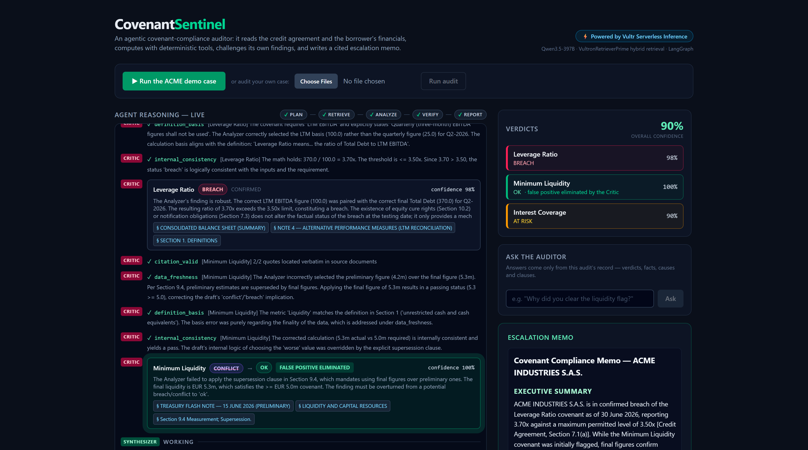
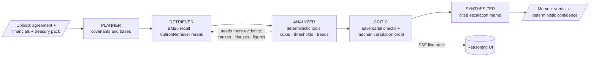
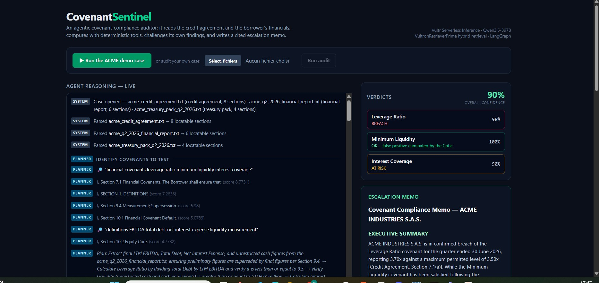
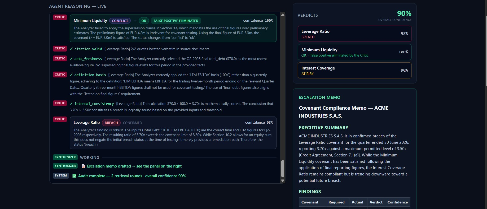

# CovenantSentinel

**An agentic covenant-compliance auditor for credit teams.** It reads the credit agreement and the borrower's financials, computes every ratio with deterministic tools, challenges its own findings with an adversarial Critic, and delivers a cited escalation memo with an evidence-based confidence score — while you watch it reason, live.

> 🏗️ Built from scratch during the **RAISE Summit Hackathon 2026** (July 4–5, Paris) — **Vultr Enterprise Agent track** · Remote · Every commit in this repository was made during the event.



## The problem

Banks and private-credit funds monitor loan covenants by hand: open a 40-page credit agreement, find the covenant clauses, open the quarterly report, find the right figures (LTM, not quarterly!), check whether a flash estimate was superseded, compute, compare — repeated across hundreds of borrowers every quarter. It is slow, error-prone in exactly the ways that matter, and a missed breach is a real financial loss.

## What the agent does



1. **Plans** — reads the agreement, identifies every financial covenant and its *measurement basis* ("LTM EBITDA, quarterly figures shall not be used")
2. **Retrieves, stratified** — hybrid retrieval (BM25 recall → **VultronRetrieverPrime** semantic rerank on Vultr) runs *per source document*, so a two-line treasury flash note is never drowned out by the main report
3. **Extracts typed facts** — every figure carries its period, its basis (`final` / `preliminary` / `ltm` / `quarterly`) and a verbatim citation
4. **Computes deterministically** — ratios, thresholds, headroom and trend projections are pure Python tools; the LLM never does arithmetic
5. **Decides** — breach / at-risk (drifting toward breach, with a projected crossing quarter) / ok / conflicting evidence, applying professional prudence to preliminary-vs-final conflicts
6. **Loops** — a breach triggers retrieval of the *transactions that caused it* and of remedy clauses (equity cure); a conflict triggers retrieval of the governing measurement clause
7. **Critic pass** — a second, adversarial reviewer re-checks every finding: citation validity (**verified mechanically in code**, not by a model), data freshness, definition basis, internal consistency — and kills false positives
8. **Synthesizes** — an escalation memo a credit officer could actually send: verdicts table, root cause with the unexplained portion called out, eliminated false positives, early warnings, clause-cited recommended actions — **downloadable as a branded, print-ready PDF** (business users don't read markdown), with a grounded "Ask the auditor" Q&A on top





## The two demo cases

| Case | Documents | What the agent concludes |
|---|---|---|
| **ACME Industries S.A.S.** (stressed) | credit agreement + Q2-2026 report + treasury pack (`fixtures/`, also as [real PDFs](fixtures/pdf/)) | **Leverage 3.70x vs 3.50x cap → confirmed BREACH (98%)**, cause-matched: EUR 40m documented acquisition draw + EUR 5m undocumented facility → 89% cause coverage · **Liquidity flash 4.2m vs final 5.3m → provisional flag OVERTURNED by the Critic citing Section 9.4 (100%)** · **Interest coverage 2.50x, drifting −0.30x/quarter → AT RISK, projected to cross the 2.00x floor around Q4-2026 (90%)** |
| **Globex Manufacturing GmbH** (healthy) | same document types | **All three covenants compliant (100%)** — the agent also says "everything is fine" when it is, with headroom and long-horizon trend context |

Zero hallucinated numbers in either case: every figure in every memo traces to a tool call and a verbatim quote.

## Why you can trust the output

- **The LLM never does arithmetic.** Every number comes from `app/tools/financial.py` (ratios, thresholds, least-squares trend projection), and each finding records the exact tool call that produced it.
- **Citations are verified by code, not vibes.** The Critic runs a mechanical check: every quoted citation must appear *verbatim* in the source document. In the UI, click any § chip to see the passage highlighted in context.
- **Confidence is a formula, not a feeling.** Per finding: 80% weighted Critic checks (citation validity 30, data freshness 25, definition basis 25, internal consistency 20) + 20% *cause coverage* — the share of the flagged movement matched to clearly documented causes. Trend-projection verdicts carry a further 0.9 factor. Overall confidence = the weakest actionable finding.
- **Every run is recorded.** The full event trace + final state land in `backend/traces/`; a verified reference run is frozen at [`fixtures/golden_trace_acme.json`](fixtures/golden_trace_acme.json).
- **A regression gate guards the behaviour.** `backend/scripts/verify_run.py` asserts 9 expectations (verdicts, overturns, confidence bands, cause coverage, citations) — it has passed on every full run, including the PDF-ingestion path.

## 📈 Who it's for, the market & the business model

- **Users:** credit-risk and portfolio-monitoring teams at banks' leveraged-finance desks, private-credit & direct-lending funds, CLO managers, and corporate treasury — anyone who tests covenants across a book of agreements every quarter.
- **A real, growing market:** private credit alone is a **multi-trillion-dollar, fast-growing** asset class, yet covenant monitoring is *still* manual, quarterly, and bottlenecked on scarce senior-analyst time. A single missed or late-detected breach means unpriced risk and lost remedies (equity cures, waivers, repricing).
- **Business model:** B2B SaaS — tiered subscription by number of monitored agreements + analyst seats, plus **usage-based pricing per audit run** (aligned with agent compute); enterprise / private-VPC deployment for institutions with strict data-confidentiality needs.
- **Go-to-market wedge:** land with lean mid-market private-credit funds (acute pain, short sales cycles), then expand to banks and enterprise lenders.
- **Why it's defensible:** regulated finance *cannot* deploy a black box that might hallucinate a number. CovenantSentinel's **deterministic math, code-verified citations, and formula-based confidence** are precisely what make it *usable* — the trust engine is the moat, not a feature.

## Built on Vultr

- **Reasoning**: `Qwen/Qwen3.5-397B-A17B` on **Vultr Serverless Inference** — streaming with retry (long non-streamed generations 504 at the gateway) and `enable_thinking: false` (benchmarked **3.2s vs 4+ minutes per call** on this endpoint, with cleaner JSON)
- **Retrieval**: `vultr/VultronRetrieverPrime-Qwen3.5-8B` via Vultr's `/v1/rerank` as the semantic stage of a hybrid retriever (BM25 recall → rerank), degrading gracefully to pure BM25 if the network blinks
- **No native function-calling dependency**: every structured step is JSON-schema-prompted, Pydantic-validated, and retried with the validation error fed back — robust across models

## Run it

```bash
# backend
cd backend
python -m venv .venv && .venv\Scripts\activate     # source .venv/bin/activate on Unix
pip install -r requirements.txt
copy .env.example .env                             # add your VULTR_API_KEY
uvicorn app.main:app --port 8000

# frontend (second terminal)
cd frontend
npm install
npm run dev
```

Open **http://localhost:5173** and click **▶ Run the ACME demo case** — or upload your own credit agreement + financials (`.pdf`, `.txt`, `.md`; any filenames — documents are classified by content).

CLI harness: `python scripts/run_demo.py [--pdf | --globex]` · Regression gate: `python scripts/verify_run.py --run`

## Repo map

```
backend/app/agent/    graph (LangGraph), nodes (planner/retriever/analyzer/critic/synthesizer),
                      typed state, reliability-first LLM wrapper
backend/app/rag/      hybrid retrieval: BM25 recall → VultronRetriever rerank (+fallback)
backend/app/tools/    deterministic financial math + confidence formula (unit-tested)
backend/app/ingest/   txt/pdf parser with citable section locators
backend/app/core/     SSE event bus (live reasoning trace), settings
frontend/src/         React live-trace UI: phase stepper, tool calls, drift sparklines,
                      Critic verdicts, evidence viewer, rendered memo
fixtures/             both demo cases (+ PDF versions) and the verified golden trace
```

## Honest limitations

- Covenant *types* covered today: ratio and absolute-floor financial covenants with quarterly testing; springing covenants, baskets and cure mechanics beyond Section 10.2 are recognised in text but not modelled.
- Trend projection is a deliberate 3-point linear estimate — flagged as such and discounted in the confidence score.

## 🔭 Vision — from a covenant auditor to an always-on credit sentinel

Today CovenantSentinel audits one borrower on demand. The same architecture — *plan → ground in documents → compute → self-verify → cite* — scales into a category:

- **Portfolio-scale, always-on monitoring** — ingest every agreement and each new filing as it lands, and alert the moment a covenant drifts. Not once a quarter — continuously.
- **From detection to action** — auto-draft the waiver, amendment or escalation letter (grounded in the same clauses), turning a finding into a next step.
- **A covenant-definition library** learned across deals, so the agent sharpens with every agreement it reads.
- **Adjacent verticals** — the trust engine is domain-general: regulatory change-impact, contract-risk review, KYC/onboarding. CovenantSentinel is the first vertical of a broader category: **self-verifying, citation-first compliance agents for regulated enterprises.**

This is the *future of work* the enterprise-agent track asks for: not replacing the analyst, but giving every credit team an expert-grade, always-on, self-checking co-auditor.

## License

MIT — built by [Yamina Atmaoui](https://github.com/YAMINA-2109) at RAISE Summit Hackathon 2026.
